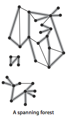

# Graphs

A graph is a set of vertices and a collection of edges that each connect a pair of vertices. We use the names 0 through V-1 for the vertices in a V-vertex graph.

## Glossary

Here are some definitions that we use.

- 
- A self-loop is an edge that connects a vertex to itself.
- Two edges are parallel if they connect the same pair of vertices.
- When an edge connects two vertices, we say that the vertices are adjacent to one another and that the edge is incident on both vertices.
- The degree of a vertex is the number of edges incident on it.
- A subgraph is a subset of a graph's edges (and associated vertices) that constitutes a graph.
- A path in a graph is a sequence of vertices connected by edges, with no repeated edges.
- A simple path is a path with no repeated vertices.
- A cycle is a path (with at least one edge) whose first and last vertices are the same.
- A simple cycle is a cycle with no repeated vertices (other than the requisite repetition of the first and last vertices).
- The length of a path or a cycle is its number of edges.
- We say that one vertex is connected to another if there exists a path that contains both of them.
- A graph is connected if there is a path from every vertex to every other vertex.
- A graph that is not connected consists of a set of connected components, which are maximal connected subgraphs.
- An acyclic graph is a graph with no cycles.
- A tree is an acyclic connected graph.
- 
- A forest is a disjoint set of trees.
- 
- A spanning tree of a connected graph is a subgraph that contains all of that graph's vertices and is a single tree. A spanning forest of a graph is the union of the spanning trees of its connected components.
- A bipartite graph is a graph whose vertices we can divide into two sets such that all edges connect a vertex in one set with a vertex in the other set. 